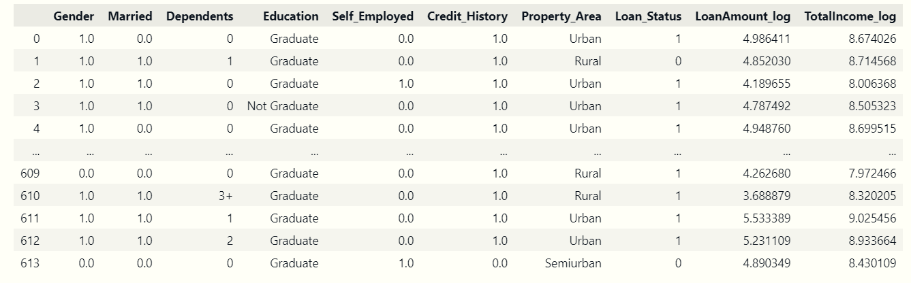

# Mini-project IV

### [Assignment](assignment.md)

## Project/Goals
Utilize the given dataset to make a prediction on which individuals are more likely to have their loan approved. The data indicates that there are 3 primary factors that determine if someone is a suitable candidate for a loan: their credit history, income and loan amount 

## Hypothesis
Base on the data, I hypothesize that the following factors will have a positive impact on the loan approval:
1. Credit History
2. Income
3. Education
4. Property Area

The bar chart shows that the loan approval rate is higher for those with a credit history of 1 and 2. This is because the credit history of 0 indicates that the applicant has no credit history. As a result, the applicant is more likely to be rejected for a loan

As we can see from the chart, the loan approval rate is higher for those with a graduate degree. This is because those with a graduate degree are more likely to have a higher income and a better credit history

    

The bar chart show that the loan approval rate is higher for those who have property in urban area.

## EDA 

The dataset exhibits gender bias, with 81.4% of the applicants being male and only 18.6% being female. Therefore, any findings based on gender alone may not be representative of the entire population and should be interpreted with caution.

Total income is created by the combination between applicant income and co-applicant income. Both of the distribution of total income and loan amount is skewed to the right, indicating that there are a few outliers with extremely high income.

## Process

1. Classify and quantify the information
2. Generate Hypothesis which factors will have a positive impact on the loan approval
3. Check null values
4. Check data types
5. Check overal statistics of the data
6. Check the distribution of the data
7. Check the data has any bias
8. Perform EDA
9. Create a model to predict the loan approval with and without the pipeline
10. Deploy the model to the web by using flask

## Results/Demo

Result of the logistic model

Grid search result of the logistic model

Result of the random forest model

Grid search result of the random forest model

Credit History has the heaviest weight in the loan approval prediction. The other features have a very small weight in the prediction.

Property area, total income, education have some influence on the loan prediction as well but not as much as credit history.
## Challanges 

1. The dataset is not balanced between the loan approval and rejection. There are 422(68.7%) loan approval and 192(31.3%) loan rejection. This may cause the model to be biased towards the loan approval.
2. The dataset has a lot of outliers. This may cause the model to be biased towards the outliers.
3. The dataset has a lot of missing values. This may cause the model to be biased towards the missing values.
4. The dataset has a lot of categorical variables. This may cause the model to be biased towards the categorical variables.

## Future Goals
1. Use more data to train the model
2. Use more features to train the model
3. Use more different models to train the model
